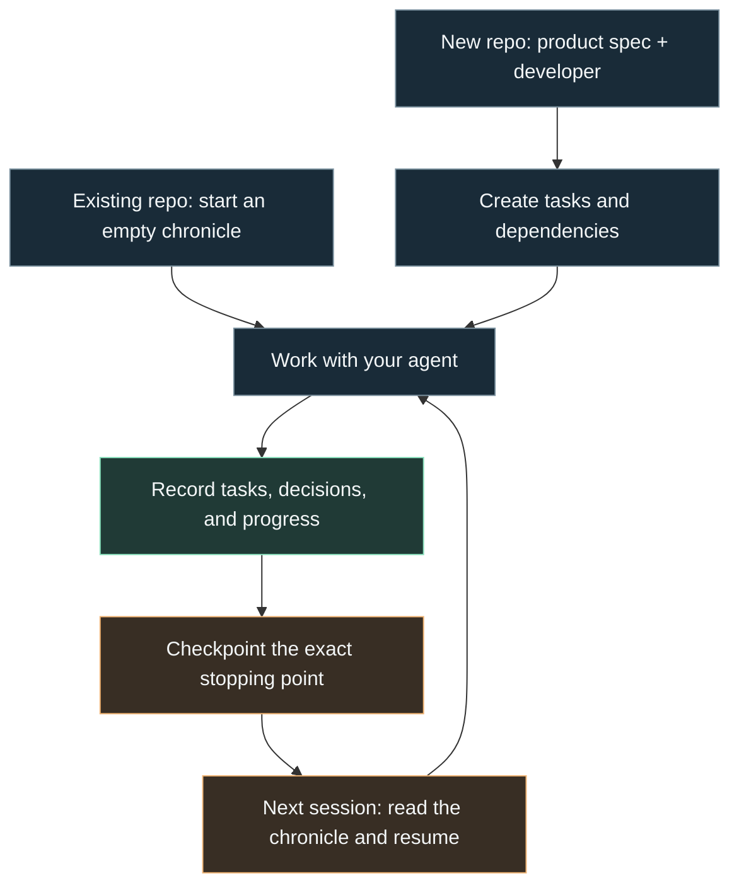

<p align="center">
  
</p>

# Prokron

**Project memory for people and coding agents.**

A session ends. You switch models. A new developer joins. The next person asks:
*What are we building, why did we choose this approach, and where do I start?*

Prokron keeps those answers in your repository. The working agent maintains a
small Markdown chronicle: **the task graph, the decisions behind it, and the
exact place to continue.** A newcomer can understand the project's direction
before reading a single line of implementation code.

[Get started](#get-started) · [See the workflow](#how-it-works) ·
[Commands](#commands) · [Specification](docs/SPEC.md)

## Give the next session a starting point

Code shows what exists. A useful handoff also explains what matters, what was
ruled out, what is unfinished, and what should happen next.

- **Know what to work on.** Tasks carry acceptance criteria and evidence; the
  graph shows dependencies, ready work, and blockers.
- **Keep the reasoning.** Architecture Decision Records (ADRs) explain material
  choices. When a choice changes, a new ADR supersedes the old one. Both remain.
- **Continue unfinished work.** One active intent captures the current task,
  stopping point, and next action.
- **Bring another agent—or another person.** The same readable files travel
  with the project, across sessions and model changes.

Six Markdown records, agent instructions, and a small installer. Everything
lives in your repo, where you can read it, review it, and commit it to Git.
There is no Prokron service to run or model API to configure.

## How it works



**Two ways in. One ongoing workflow.** A new project begins with the
specification and the developer. An existing project begins empty and records
work from that session onward, without inventing a past. A populated chronicle
is preserved when you initialize again.

### What the next agent inherits

Imagine pausing halfway through a CSV export feature. A handoff might contain:

| Question | Recorded answer |
|---|---|
| What is the goal? | Let users export the transactions they are viewing. |
| What is active? | `T-014`: export filtered transactions; implementation complete, validation pending. |
| What depends on it? | `T-015`: export from saved views, blocked by `T-014`. |
| Why this behavior? | `ADR-006`: export only the filtered result; supersedes `ADR-003`, which proposed exporting all transactions. |
| Where did work stop? | Export is implemented; the empty-result case still needs checking. |
| What happens next? | Verify that an empty result produces a header-only CSV, then record the evidence. |

This is an illustrative example, not a test result. The point is a concrete
place to resume: the next agent knows which code to inspect and why.

## Get started

### 1. Install in your project

From the root of an **existing project**, run:

```sh
gh api -H 'Accept: application/vnd.github.raw+json' 'repos/qomerovn/prokron/contents/install.sh?ref=main' | sh -s -- existing
```

For a **new project**, replace `existing` with `new` and bring your product spec.
The repository is currently private, so this command requires an authenticated
[GitHub CLI](https://cli.github.com/) with repository access.

The installer adds `.prokron/`, shared instructions, portable workflows, and
command files for Codex, Claude Code, and OpenCode. It preserves existing
records and custom instructions, restores missing files, and prints what to run
in your agent chat.

<details>
<summary>Install from a local checkout or after public release</summary>

From a downloaded or cloned Prokron checkout, installation works offline:

```sh
sh ./install.sh existing /path/to/your/project
```

Once this repository is public, anonymous installation will be available with:

```sh
curl -fsSL https://raw.githubusercontent.com/qomerovn/prokron/main/install.sh | sh -s -- existing
```

Use `new` for a new project. Anonymous delivery remains unverified while the
repository is private.

</details>

### 2. Start in your agent chat

| Agent host | Existing project | New project |
|---|---|---|
| Codex | `$prokron init existing` | `$prokron init new` |
| Claude Code / OpenCode | `/prokron-init existing` | `/prokron-init new` |
| Other capable coding agents | Read `AGENTS.md`, then follow `commands/prokron-init.md` in existing mode. | Same instruction, in new mode. |

### 3. Work normally

Ask for the work you want done. The installed rules instruct the agent to
create tasks before implementation, append decisions when they are made, and
keep progress current. You do not need a slash command for every update.

At the next session, use `/prokron-resume` or `$prokron resume` to continue from
the saved chronicle.

## What lives in the chronicle

The **task graph** and **decision history** are the core. Four supporting
records connect the plan to what is actually happening.

| File in `.prokron/` | What it preserves |
|---|---|
| **`TASK_GRAPH.md`** | The path forward: dependencies, ready work, and blockers. |
| **`DECISIONS.md`** | The reasoning: append-only ADRs and their supersession chain. |
| `TASKS.md` | The work: owners, acceptance criteria, status, and evidence. |
| `STATE.md` | The present: project position, risks, and next steps. |
| `INTENT.md` | The focus: zero or one active task and its exact execution point. |
| `JOURNAL.md` | The diary: progress, validation, unfinished work, and handoffs. |

See the [chronicle guide](.prokron/README.md) for the read order, or
[Prokron's own task graph](.prokron/TASK_GRAPH.md) and
[decision history](.prokron/DECISIONS.md) for a real example.

## Commands

Use these when you want to invoke a workflow explicitly.

| Purpose | Claude Code / OpenCode | Codex |
|---|---|---|
| Initialize | `/prokron-init [new\|existing]` | `$prokron init [new\|existing]` |
| Start or continue a task | `/prokron-work [task]` | `$prokron work [task]` |
| Record or supersede a decision | `/prokron-decide [decision]` | `$prokron decide [decision]` |
| Save a handoff | `/prokron-checkpoint` | `$prokron checkpoint` |
| Recover current work | `/prokron-resume` | `$prokron resume` |

All workflows also live in [`commands/`](commands) as portable Markdown prompts.

## Use the model you prefer

Prokron configures the **agent host** that reads files and does the work.
GLM, MiniMax, Mistral, Grok, and other models use the same chronicle through a
compatible host; provider setup and model selection stay with that host.

Codex receives a project skill. Claude Code and OpenCode receive project
commands. Hosts that load [`AGENTS.md`](https://agents.md/) can follow the shared
rules; for other capable agents, explicitly ask them to read it and follow the
relevant file in `commands/`.

For OpenCode setup, see its [providers](https://opencode.ai/docs/providers),
[instructions](https://opencode.ai/docs/rules/), and
[custom commands](https://opencode.ai/docs/commands/) documentation.
Behavior depends on the host and model following these instructions.

## Checkpoint before context runs out

The rules call for a checkpoint before handoff, compaction, session ending, or
any known or estimated context, token, time, rate, or quota limit—including
five-hour and seven-day windows. When the host exposes no meter, the fallback
is to checkpoint after meaningful milestones and before long-running work.

**Prokron is an instruction-based workflow.** It cannot read hidden quota
counters or guarantee a final write after an abrupt cutoff. Frequent records
give the next session a recent place to resume; the working agent must maintain
them.

Installation and preservation checks pass. Real-session agent compliance and
quota-warning behavior still need a [handoff pilot](docs/SPEC.md#handoff-pilot)
with your chosen host and model. Run the installer checks from this checkout:

```sh
sh tests/install.sh
```

## Updating an installation

Reinstalling adds missing files; it **does not upgrade existing guidance**.
It prints a reminder when guidance is retained. From a current Prokron checkout,
review and merge changes to:

- `commands/`, `.claude/commands/`, and `.opencode/commands/`;
- `.agents/skills/prokron/SKILL.md`;
- `templates/.prokron/README.md`, installed as `.prokron/README.md`;
- the Prokron block in `AGENTS.md`, preserving surrounding project rules.

Keep customizations and all six chronicle records. Never copy empty templates
over project history.

## Help improve the workflow

Try the [handoff pilot](docs/SPEC.md#handoff-pilot) in a disposable project.
When reporting a gap, include the host/model, the request, what was recorded,
and what the next session could not recover. Remove private project details
before sharing.

Changes should keep Prokron small and readable. The
[specification](docs/SPEC.md) defines the working agreement and scope.

## License

Apache-2.0. See [LICENSE](LICENSE), [NOTICE](NOTICE), and
[TRADEMARKS.md](TRADEMARKS.md).
