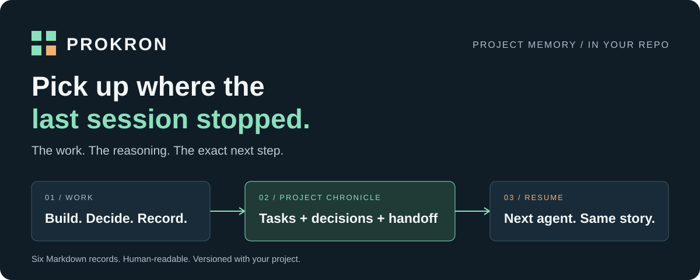
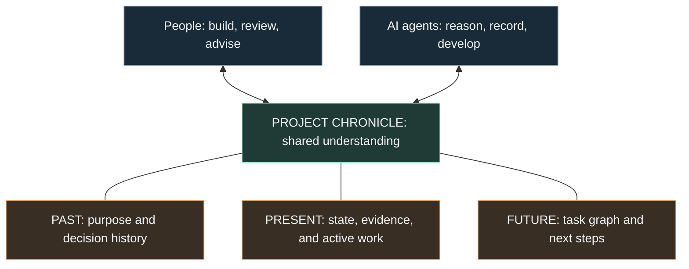

<p align="center">
  
</p>

# Prokron

**One project. Shared understanding.**

**Prokron is short for Project Chronicle.** It gives people and AI a common
language for understanding a project: why it exists, which decisions shaped it,
where it stands, and where it is going.

Every project has a story behind its code. An idea became a plan. A constraint
changed a decision. A promising approach was tried, then replaced. Those reasons
matter to everyone who builds, reviews, advises on, or inherits the project.

Prokron keeps that story in a living Markdown chronicle inside your repository.
**The task graph shows where the work is going. The decision history explains
how it got here.** People and AI can read the same record, question the same
assumptions, and work from the same understanding—before reading implementation
code.

[Get started](#get-started) · [See the workflow](#how-it-works) ·
[Commands](#commands) · [Specification](docs/SPEC.md)

## Make the project understandable

A founder explaining a change in direction. A teammate joining months later.
An AI agent proposing the next step. Each needs context that survives the
conversation where it first appeared.

| The question | What the chronicle makes visible |
|---|---|
| **Why does this project exist?** | Its purpose, intended outcome, and the work chosen to serve it. |
| **Why did we take this path?** | Decisions, constraints, alternatives, and the reasons earlier choices changed. |
| **Where are we now?** | Completed work and its evidence, open questions, blockers, and the active task. |
| **What should happen next?** | A task graph with dependencies, acceptance criteria, and an explicit next action. |

The benefit is shared context: a person can review the reasoning, an AI can
use it to propose work, and the team can challenge either against the same
record. When understanding changes, the chronicle changes with it.

Decisions are recorded as Architecture Decision Records (ADRs). A new decision
can supersede an earlier one, but the earlier reasoning stays visible. The
project's evolution remains explainable.

Six Markdown records, agent instructions, and a small installer. Everything
lives in your repo, where you can read it, review it, and commit it to Git.
There is no Prokron service to run or model API to configure.

## How it works



People set direction, discuss tradeoffs, and review outcomes. The working agent
is instructed to record new tasks, material decisions, and progress as the work
happens. Both can consult and maintain the same files. Human-to-human,
human-to-AI, and AI-to-AI handoffs draw on that shared history.

**Two ways to begin:**

- **New project:** work from the product specification with the developer to
  create the initial tasks, graph, decisions, and state.
- **Existing project:** start with an empty chronicle and record from now on.
  Earlier history is reconstructed only if explicitly requested; Prokron does
  not invent it.

A populated chronicle is preserved when you initialize again.

### A project story everyone can follow

Imagine a team building an expense tool for freelancers. Months into the work,
a new teammate or AI advisor asks why bank synchronization is absent:

| Question | Recorded answer |
|---|---|
| Why are we building this? | Help freelancers prepare expense records without maintaining a spreadsheet. |
| What did we originally choose? | `ADR-002` proposed bank synchronization to reduce manual entry. |
| Why did the direction change? | `ADR-007` superseded it: launch with CSV import because supported banks did not cover the first users. Revisit when coverage improves. |
| Where is the project now? | Import is complete; duplicate detection is in progress; validation evidence is linked from the tasks. |
| What comes next? | Finish duplicate detection before starting monthly summaries. The task graph records that dependency. |

The teammate can explain the tradeoff. The advisor can question whether the
constraint still holds. The coding agent can choose work consistent with the
current decision. Everyone has the context to move the discussion forward.

*Illustrative example; these are not claims about a deployed project.*

## Get started

### 1. Install in your project

From the root of an **existing project**, run:

```sh
gh api -H 'Accept: application/vnd.github.raw+json' 'repos/qomerovn/prokron/contents/install.sh?ref=main' | sh -s -- existing
```

For a **new project**, replace `existing` with `new` and bring your product spec.
The repository is currently private, so this command requires an authenticated
[GitHub CLI](https://cli.github.com/) with repository access.

The installer adds `.prokron/`, shared instructions, portable workflows, and
command files for Codex, Claude Code, and OpenCode. It preserves existing
records and custom instructions, restores missing files, and prints what to run
in your agent chat.

<details>
<summary>Install from a local checkout or after public release</summary>

From a downloaded or cloned Prokron checkout, installation works offline:

```sh
sh ./install.sh existing /path/to/your/project
```

Once this repository is public, anonymous installation will be available with:

```sh
curl -fsSL https://raw.githubusercontent.com/qomerovn/prokron/main/install.sh | sh -s -- existing
```

Use `new` for a new project. Anonymous delivery remains unverified while the
repository is private.

</details>

### 2. Start in your agent chat

| Agent host | Existing project | New project |
|---|---|---|
| Codex | `$prokron init existing` | `$prokron init new` |
| Claude Code / OpenCode | `/prokron-init existing` | `/prokron-init new` |
| Other capable coding agents | Read `AGENTS.md`, then follow `commands/prokron-init.md` in existing mode. | Same instruction, in new mode. |

### 3. Work normally

Ask for the work you want done. The installed rules instruct the agent to
create tasks before implementation, append decisions when they are made, and
keep progress current. You do not need a slash command for every update.

Use the chronicle in discussions and reviews, too: ask why a decision was made,
what changed, or which work serves the current goal. Record material changes
so the next person or agent can follow the reasoning.

At the next session, use `/prokron-resume` or `$prokron resume` to continue from
the saved chronicle.

## What lives in the chronicle

The **task graph** and **decision history** are the core. Four supporting
records connect purpose and history to what is actually happening.

| File in `.prokron/` | What it preserves |
|---|---|
| **`TASK_GRAPH.md`** | The path forward: dependencies, ready work, and blockers. |
| **`DECISIONS.md`** | The reasoning: append-only ADRs and their supersession chain. |
| `TASKS.md` | The work: owners, acceptance criteria, status, and evidence. |
| `STATE.md` | The present: project purpose, position, risks, and next steps. |
| `INTENT.md` | The focus: zero or one active task and its exact execution point. |
| `JOURNAL.md` | The diary: progress, validation, unfinished work, and handoffs. |

See the [chronicle guide](.prokron/README.md) for the read order, or
[Prokron's own task graph](.prokron/TASK_GRAPH.md) and
[decision history](.prokron/DECISIONS.md) for a real example.

## Commands

Use these when you want to invoke a workflow explicitly.

| Purpose | Claude Code / OpenCode | Codex |
|---|---|---|
| Initialize | `/prokron-init [new\|existing]` | `$prokron init [new\|existing]` |
| Start or continue a task | `/prokron-work [task]` | `$prokron work [task]` |
| Record or supersede a decision | `/prokron-decide [decision]` | `$prokron decide [decision]` |
| Save a handoff | `/prokron-checkpoint` | `$prokron checkpoint` |
| Recover current work | `/prokron-resume` | `$prokron resume` |

All workflows also live in [`commands/`](commands) as portable Markdown prompts.

## Use the model you prefer

Prokron configures the **agent host** that reads files and does the work.
GLM, MiniMax, Mistral, Grok, and other models use the same chronicle through a
compatible host; provider setup and model selection stay with that host.

Codex receives a project skill. Claude Code and OpenCode receive project
commands. Hosts that load [`AGENTS.md`](https://agents.md/) can follow the shared
rules; for other capable agents, explicitly ask them to read it and follow the
relevant file in `commands/`.

For OpenCode setup, see its [providers](https://opencode.ai/docs/providers),
[instructions](https://opencode.ai/docs/rules/), and
[custom commands](https://opencode.ai/docs/commands/) documentation.
Behavior depends on the host and model following these instructions.

## Checkpoint before context runs out

The rules call for a checkpoint before handoff, compaction, session ending, or
any known or estimated context, token, time, rate, or quota limit—including
five-hour and seven-day windows. When the host exposes no meter, the fallback
is to checkpoint after meaningful milestones and before long-running work.

**Prokron is an instruction-based workflow.** It cannot read hidden quota
counters or guarantee a final write after an abrupt cutoff. Frequent records
give the next session a recent place to resume; the working agent must maintain
them.

Installation and preservation checks pass. Real-session agent compliance and
quota-warning behavior still need a [handoff pilot](docs/SPEC.md#handoff-pilot)
with your chosen host and model. Run the installer checks from this checkout:

```sh
sh tests/install.sh
```

## Updating an installation

Reinstalling adds missing files; it **does not upgrade existing guidance**.
It prints a reminder when guidance is retained. From a current Prokron checkout,
review and merge changes to:

- `commands/`, `.claude/commands/`, and `.opencode/commands/`;
- `.agents/skills/prokron/SKILL.md`;
- `templates/.prokron/README.md`, installed as `.prokron/README.md`;
- the Prokron block in `AGENTS.md`, preserving surrounding project rules.

Keep customizations and all six chronicle records. Never copy empty templates
over project history.

## Help improve the workflow

Try the [handoff pilot](docs/SPEC.md#handoff-pilot) in a disposable project.
When reporting a gap, include the host/model, the request, what was recorded,
and what a person or agent could not understand from it. Remove private project
details before sharing.

Changes should keep Prokron small and readable. The
[specification](docs/SPEC.md) defines the working agreement and scope.

## License

Apache-2.0. See [LICENSE](LICENSE), [NOTICE](NOTICE), and
[TRADEMARKS.md](TRADEMARKS.md).
